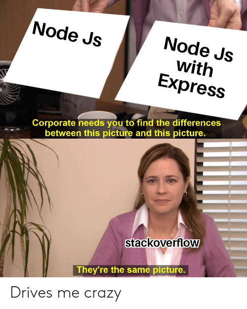

+++


---


---

@snap[midpoint span-50]

@snapend

+++



---

## A Node futtatókörnyezet

@ul[list-square-bullets list-spaced-bullets font-righteous]
* Nem backend keretrendszer
* Inkább szerver oldali platform
* Webszerverek kiszolgálására
* V8 motor
* Event-loop és aszinkron I/O
@ulend

--- 

## Express
A legnépszerűbb Node alapú backend keretrendszer

---

### Egyszerű, gyors és skálázható webalkalmazások

#### Fő építő elemei:
 - Útvonal választás
 - Middleware függvények

--- 

### App objektum és a routing

+++
@snap[north snap-40]
### A szerver indítása
@snapend

```js 
const express = require('express')
const app = express()
const port = 3000

app.listen(port, () => console.log(`Example app listening on port ${port}!`))

```

@[1,2]
@[3]
@[5]

+++
@snap[north snap-40]
### Routing
@snapend

```js
app.use('/user', middlewareA(), (req, resp, next) =>{ });

app.get('/user/:id', middlewareA(), middlewareB());
app.post('/user', middlewareB());
app.delete('/user/:id', middlewareA(), middlewareB());

```
@snap[south]
@[1](Összes kérés beérkezik, ami az URL-re illeszkedik)
@[3-5](Csak a megfelelő kérés beérkezésekor reagál)
@snapend

---

## Middlewarek

+++
@ul[list-square-bullets list-spaced-bullets font-righteous]
- Egyszerű feladat
- Kérés és válasz kezelése
- Láncolható
- Visszatérhet vagy továbbmehet
@ulend
+++
@snap[north snap-40]
### Request
@snapend

```js
const bodyParser = require('body-parser')
// for parsing application/json
app.use(bodyParser.json()) 

...

const myMiddleware = (req, res, next) => {
    const formData = req.body;
    const userid = req.params.id;
    const path = req.path;
    const colorQuery = req.query.color;
    console.log(req.method);

    next()
}
```

@snap[south]
@[1-3](Body-parser kell a HTTP body eléréséhez)
@[7-14]
@[8](Body-ban található JSON adatok)
@[9](Url paraméterek itt pl. user/:id)
@[10](Relative elérési út)
@[11](Query paraméterek pl. ?color=black)
@[12](A kérés HTTP metódusa)
@[14]
@snapend

+++
@snap[north snap-40]
### Response
@snapend

```js
//Valami middleware
const myMiddleware = (req, res, next) => {
    const myCat = { name: 'Miau', age: '2' } 
    res.json(myCat);
    res.status(200);
    res.send('Express is so easy, OMG!!');
    res.redirect('/youaredumb');

    res.append('Bearer', myToken);
    res.cookie(...cookie);

    next();
}
```

@snap[south]
@[3,4]
@[5]
@[6]
@[7]
@[9,10]
@[12]
@snapend

---
@snap[north snap-40]
### Hibakezelés
@snapend
```js
const myMiddleware = (err, req, res, next) => {
    if(err){
        res.status(500);
        res.send('Hoopsie Woopsie!');
    }
}
```

---

## Perzisztens adattárolás MongoDB-vel


---
@snap[north snap-40]
### Fő tulajdonságai
@snap[north snap-40]

@ul[list-square-bullets list-spaced-bullets font-righteous]
- NoSQL adatbázis
- JSON dokumentumok tárolása
- Struktúrálatlan adatok
- Nincs validáció
@ulend
---
@snap[north snap-40]
### Mongoose package
@snapend

@ul[list-square-bullets list-spaced-bullets font-righteous]
- ODM könyvtár
- JavaScript objektumok mappelés
- MongoDB kezelés
@ulend

+++

```js
const mongoose = require('mongoose');

mongoose.connect('mongodb://localhost:27017/test',
                 {useNewUrlParser: true, useUnifiedTopology: true});
```

+++
@snap[north snap-40]
### Séma és modell
@snapend
```js
import mongoose from 'mongoose';

const catSchema = new mongoose.Schema({
    name:  String, // String is shorthand for {type: String}
    age: Number,
    owner:   mongoose.Schema.Types.ObjectId,
    favoriteFood: { name: String, producing: String },
  });

export default const Cat = mongoose.model('Cat', catSchema);

```

+++
@snap[north snap-40]
### TypeScript + mongoose
@snapend
```ts
//TypeScript interface
import { model, Document } from 'mongoose';
import { IUser } from 'models/User';

interface ICat extends Document {
    name: string;
    age: number;
    owner: IUser[_id];
    favoriteFood: { name: string, producing: string };
}

export default model<ICat>('Cat', catSchema);
```

+++
@snap[north snap-40]
### Modell használata
@snapend
```js
import Cat from 'models/Cat';

const myMiddleware = (err, req, res, next) => {
    const Cat = new Cat();
    Cat.name = 'Garfield';
    Cat.favoriteFood = { name: 'Lasagne', producing: 'Nyau Inc.'}
    Cat.save((err, item) => {
        if(!err){
            res.send(item);
        }
    });

    Cat.findOne({name: 'Garfield'}, (err, item) => {
        if(!err){
            console.log(item);
        }
    });

    Cat.deleteOne({name: 'Garfield'}, (err) => {
        if(!err){
            res.status(204).send();
        }
    });
}
```

@[4-11]
@[13-17]
@[19-23]

---?image=assets/images/question.jpg

@snap[south snap-40]
## Kérdések?
@snapend
