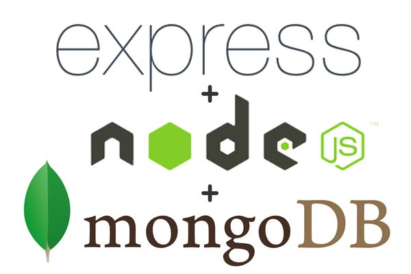

# Express**JS**

+++

# Express**TS**

---



---

@snap[span-50]

@snapend

---

## A Node futtatókörnyezet

@ul[list-square-bullets list-spaced-bullets font-righteous]
* Nem backend keretrendszer
* Inkább szerver oldali platform
* Webszerverek kiszolgálására
* V8 motor
* Event-loop és aszinkron I/O
@ulend

--- 

# Express
A legnépszerűbb Node alapú backend keretrendszer

---

## Egyszerű, gyors és skálázható webalkalmazások

### Fő építő elemei:
 - Útvonal választás
 - Middleware függvények

--- 

## App objektum és a routing

+++

```js 
const express = require('express')
const app = express()
const port = 3000

app.listen(port, () => console.log(`Example app listening on port ${port}!`))

```

@[1,2]
@[3]
@[5]

+++

```js
app.use('/user', middlewareA(), (req, resp, next) =>{ });

app.get('/user/:id', middlewareA(), middlewareB());
app.post('/user', middlewareB());
app.delete('/user/:id', middlewareA(), middlewareB());

```

@[1](Összes kérés beárkezik)
@[3-5](Csak a megfelelő kérés érkezésekor reagál)

---

## Middlewarek

+++

### Request objektum

kód

+++

### Response objektum

kód

+++

### A next() függvény

---

### Hibakezelés

+++

Kód

---

## Perzisztens adattárolás MongoDB-vel

---

@ul
- NoSQL adatbázis
- JSON dokumentumok tárolása
- Struktúrálatlan adatok
- Nincs validáció
@ulend
---

### Mongoose package

@ul
- ODM könyvtár
- JavaScript objektumok mappelése
- MongoDB kezelése
@ulend

+++

Kód

---


